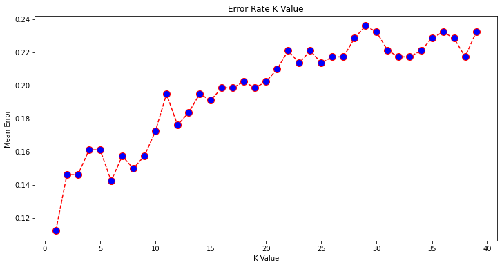

```python
import pandas as pd
```


```python
from sklearn import preprocessing
```


```python
from sklearn.model_selection import train_test_split
```


```python
from sklearn import neighbors
```


```python
from sklearn.metrics import confusion_matrix
```


```python
from sklearn.metrics import accuracy_score
```


```python
dataset=pd.read_csv("SVMtrain.csv")
```


```python
dataset.columns
```


    Index(['PassengerId', 'Survived', 'Pclass', 'Sex', 'Age', 'SibSp', 'Parch',
           'Fare', 'Embarked'],
          dtype='object')


```python
dataset.head()
```


<div>
<style scoped>
    .dataframe tbody tr th:only-of-type {
        vertical-align: middle;
    }

    .dataframe tbody tr th {
        vertical-align: top;
    }

    .dataframe thead th {
        text-align: right;
    }
</style>
<table border="1" class="dataframe">
  <thead>
    <tr style="text-align: right;">
      <th></th>
      <th>PassengerId</th>
      <th>Survived</th>
      <th>Pclass</th>
      <th>Sex</th>
      <th>Age</th>
      <th>SibSp</th>
      <th>Parch</th>
      <th>Fare</th>
      <th>Embarked</th>
    </tr>
  </thead>
  <tbody>
    <tr>
      <th>0</th>
      <td>1</td>
      <td>0</td>
      <td>3</td>
      <td>Male</td>
      <td>22.0</td>
      <td>1</td>
      <td>0</td>
      <td>7.2500</td>
      <td>3</td>
    </tr>
    <tr>
      <th>1</th>
      <td>2</td>
      <td>1</td>
      <td>1</td>
      <td>female</td>
      <td>38.0</td>
      <td>1</td>
      <td>0</td>
      <td>71.2833</td>
      <td>1</td>
    </tr>
    <tr>
      <th>2</th>
      <td>3</td>
      <td>1</td>
      <td>3</td>
      <td>female</td>
      <td>26.0</td>
      <td>0</td>
      <td>0</td>
      <td>7.9250</td>
      <td>3</td>
    </tr>
    <tr>
      <th>3</th>
      <td>4</td>
      <td>1</td>
      <td>1</td>
      <td>female</td>
      <td>35.0</td>
      <td>1</td>
      <td>0</td>
      <td>53.1000</td>
      <td>3</td>
    </tr>
    <tr>
      <th>4</th>
      <td>5</td>
      <td>0</td>
      <td>3</td>
      <td>Male</td>
      <td>35.0</td>
      <td>0</td>
      <td>0</td>
      <td>8.0500</td>
      <td>3</td>
    </tr>
  </tbody>
</table>
</div>


```python
dataset1=dataset.drop(["PassengerId"],axis=1)
```


```python
dataset1.head()
```


<div>
<style scoped>
    .dataframe tbody tr th:only-of-type {
        vertical-align: middle;
    }

    .dataframe tbody tr th {
        vertical-align: top;
    }

    .dataframe thead th {
        text-align: right;
    }
</style>
<table border="1" class="dataframe">
  <thead>
    <tr style="text-align: right;">
      <th></th>
      <th>Survived</th>
      <th>Pclass</th>
      <th>Sex</th>
      <th>Age</th>
      <th>SibSp</th>
      <th>Parch</th>
      <th>Fare</th>
      <th>Embarked</th>
    </tr>
  </thead>
  <tbody>
    <tr>
      <th>0</th>
      <td>0</td>
      <td>3</td>
      <td>Male</td>
      <td>22.0</td>
      <td>1</td>
      <td>0</td>
      <td>7.2500</td>
      <td>3</td>
    </tr>
    <tr>
      <th>1</th>
      <td>1</td>
      <td>1</td>
      <td>female</td>
      <td>38.0</td>
      <td>1</td>
      <td>0</td>
      <td>71.2833</td>
      <td>1</td>
    </tr>
    <tr>
      <th>2</th>
      <td>1</td>
      <td>3</td>
      <td>female</td>
      <td>26.0</td>
      <td>0</td>
      <td>0</td>
      <td>7.9250</td>
      <td>3</td>
    </tr>
    <tr>
      <th>3</th>
      <td>1</td>
      <td>1</td>
      <td>female</td>
      <td>35.0</td>
      <td>1</td>
      <td>0</td>
      <td>53.1000</td>
      <td>3</td>
    </tr>
    <tr>
      <th>4</th>
      <td>0</td>
      <td>3</td>
      <td>Male</td>
      <td>35.0</td>
      <td>0</td>
      <td>0</td>
      <td>8.0500</td>
      <td>3</td>
    </tr>
  </tbody>
</table>
</div>


```python
le=preprocessing.LabelEncoder()
```


```python
le.fit(dataset['Sex'])
```


    LabelEncoder()


```python
print(le.classes_)
```

    ['Male' 'female']
    


```python
dataset1['Sex']=le.transform(dataset1['Sex'])
```


```python
dataset1.head()
```


<div>
<style scoped>
    .dataframe tbody tr th:only-of-type {
        vertical-align: middle;
    }

    .dataframe tbody tr th {
        vertical-align: top;
    }

    .dataframe thead th {
        text-align: right;
    }
</style>
<table border="1" class="dataframe">
  <thead>
    <tr style="text-align: right;">
      <th></th>
      <th>Survived</th>
      <th>Pclass</th>
      <th>Sex</th>
      <th>Age</th>
      <th>SibSp</th>
      <th>Parch</th>
      <th>Fare</th>
      <th>Embarked</th>
    </tr>
  </thead>
  <tbody>
    <tr>
      <th>0</th>
      <td>0</td>
      <td>3</td>
      <td>0</td>
      <td>22.0</td>
      <td>1</td>
      <td>0</td>
      <td>7.2500</td>
      <td>3</td>
    </tr>
    <tr>
      <th>1</th>
      <td>1</td>
      <td>1</td>
      <td>1</td>
      <td>38.0</td>
      <td>1</td>
      <td>0</td>
      <td>71.2833</td>
      <td>1</td>
    </tr>
    <tr>
      <th>2</th>
      <td>1</td>
      <td>3</td>
      <td>1</td>
      <td>26.0</td>
      <td>0</td>
      <td>0</td>
      <td>7.9250</td>
      <td>3</td>
    </tr>
    <tr>
      <th>3</th>
      <td>1</td>
      <td>1</td>
      <td>1</td>
      <td>35.0</td>
      <td>1</td>
      <td>0</td>
      <td>53.1000</td>
      <td>3</td>
    </tr>
    <tr>
      <th>4</th>
      <td>0</td>
      <td>3</td>
      <td>0</td>
      <td>35.0</td>
      <td>0</td>
      <td>0</td>
      <td>8.0500</td>
      <td>3</td>
    </tr>
  </tbody>
</table>
</div>


```python
y=dataset1['Pclass']
```


```python
X=dataset1.drop(['Pclass'],axis=1)
```


```python
X.head()
```


<div>
<style scoped>
    .dataframe tbody tr th:only-of-type {
        vertical-align: middle;
    }

    .dataframe tbody tr th {
        vertical-align: top;
    }

    .dataframe thead th {
        text-align: right;
    }
</style>
<table border="1" class="dataframe">
  <thead>
    <tr style="text-align: right;">
      <th></th>
      <th>Survived</th>
      <th>Sex</th>
      <th>Age</th>
      <th>SibSp</th>
      <th>Parch</th>
      <th>Fare</th>
      <th>Embarked</th>
    </tr>
  </thead>
  <tbody>
    <tr>
      <th>0</th>
      <td>0</td>
      <td>0</td>
      <td>22.0</td>
      <td>1</td>
      <td>0</td>
      <td>7.2500</td>
      <td>3</td>
    </tr>
    <tr>
      <th>1</th>
      <td>1</td>
      <td>1</td>
      <td>38.0</td>
      <td>1</td>
      <td>0</td>
      <td>71.2833</td>
      <td>1</td>
    </tr>
    <tr>
      <th>2</th>
      <td>1</td>
      <td>1</td>
      <td>26.0</td>
      <td>0</td>
      <td>0</td>
      <td>7.9250</td>
      <td>3</td>
    </tr>
    <tr>
      <th>3</th>
      <td>1</td>
      <td>1</td>
      <td>35.0</td>
      <td>1</td>
      <td>0</td>
      <td>53.1000</td>
      <td>3</td>
    </tr>
    <tr>
      <th>4</th>
      <td>0</td>
      <td>0</td>
      <td>35.0</td>
      <td>0</td>
      <td>0</td>
      <td>8.0500</td>
      <td>3</td>
    </tr>
  </tbody>
</table>
</div>


```python
X_train,X_test,y_train,y_test=train_test_split(X,y,test_size=0.3,random_state=0)
```


```python
X_train.head()
```


<div>
<style scoped>
    .dataframe tbody tr th:only-of-type {
        vertical-align: middle;
    }

    .dataframe tbody tr th {
        vertical-align: top;
    }

    .dataframe thead th {
        text-align: right;
    }
</style>
<table border="1" class="dataframe">
  <thead>
    <tr style="text-align: right;">
      <th></th>
      <th>Survived</th>
      <th>Sex</th>
      <th>Age</th>
      <th>SibSp</th>
      <th>Parch</th>
      <th>Fare</th>
      <th>Embarked</th>
    </tr>
  </thead>
  <tbody>
    <tr>
      <th>350</th>
      <td>0</td>
      <td>0</td>
      <td>60.0</td>
      <td>0</td>
      <td>0</td>
      <td>35.0000</td>
      <td>3</td>
    </tr>
    <tr>
      <th>124</th>
      <td>1</td>
      <td>0</td>
      <td>12.0</td>
      <td>1</td>
      <td>0</td>
      <td>11.2417</td>
      <td>1</td>
    </tr>
    <tr>
      <th>577</th>
      <td>0</td>
      <td>1</td>
      <td>60.0</td>
      <td>1</td>
      <td>0</td>
      <td>14.4583</td>
      <td>1</td>
    </tr>
    <tr>
      <th>422</th>
      <td>0</td>
      <td>1</td>
      <td>28.0</td>
      <td>1</td>
      <td>1</td>
      <td>14.4000</td>
      <td>3</td>
    </tr>
    <tr>
      <th>118</th>
      <td>0</td>
      <td>1</td>
      <td>2.0</td>
      <td>4</td>
      <td>2</td>
      <td>31.2750</td>
      <td>3</td>
    </tr>
  </tbody>
</table>
</div>


```python
y_train.head()
```


    350    1
    124    3
    577    3
    422    3
    118    3
    Name: Pclass, dtype: int64


```python
X_test.head()
```


<div>
<style scoped>
    .dataframe tbody tr th:only-of-type {
        vertical-align: middle;
    }

    .dataframe tbody tr th {
        vertical-align: top;
    }

    .dataframe thead th {
        text-align: right;
    }
</style>
<table border="1" class="dataframe">
  <thead>
    <tr style="text-align: right;">
      <th></th>
      <th>Survived</th>
      <th>Sex</th>
      <th>Age</th>
      <th>SibSp</th>
      <th>Parch</th>
      <th>Fare</th>
      <th>Embarked</th>
    </tr>
  </thead>
  <tbody>
    <tr>
      <th>14</th>
      <td>0</td>
      <td>1</td>
      <td>14.0</td>
      <td>0</td>
      <td>0</td>
      <td>7.8542</td>
      <td>3</td>
    </tr>
    <tr>
      <th>158</th>
      <td>0</td>
      <td>0</td>
      <td>60.0</td>
      <td>8</td>
      <td>2</td>
      <td>69.5500</td>
      <td>3</td>
    </tr>
    <tr>
      <th>762</th>
      <td>1</td>
      <td>1</td>
      <td>36.0</td>
      <td>1</td>
      <td>2</td>
      <td>120.0000</td>
      <td>3</td>
    </tr>
    <tr>
      <th>740</th>
      <td>0</td>
      <td>0</td>
      <td>36.0</td>
      <td>1</td>
      <td>0</td>
      <td>78.8500</td>
      <td>3</td>
    </tr>
    <tr>
      <th>482</th>
      <td>1</td>
      <td>1</td>
      <td>63.0</td>
      <td>0</td>
      <td>0</td>
      <td>9.5875</td>
      <td>3</td>
    </tr>
  </tbody>
</table>
</div>


```python
y_test.head()
```


    14     3
    158    3
    762    1
    740    1
    482    3
    Name: Pclass, dtype: int64


```python
knn=neighbors.KNeighborsClassifier(n_neighbors=3)
```


```python
knn.fit(X_train,y_train).score(X_test,y_test)
```


    0.8539325842696629


```python
y_pred=knn.predict(X_test)
```


```python
confusion_matrix(y_test,y_pred)
```


    array([[ 60,   6,   4],
           [  7,  27,  15],
           [  3,   4, 141]], dtype=int64)


           actual(training dataset)
          1    2    3
p T     1 [ 60,   6,   4],
r e     2 [  7,  27,  15],
e s     3 [  3,   4, 141]], dtype

total number of record =267
correctly classified(diagonal) =60+27+141=228
incorrectly classified=6+4+7+15+3+4=39
Hence,85.39 data is correctly classfied =ACCURACY SCORE
16.104 data is incorrectly classified

Dv           IDV          K             Accuracy score
Pclass      remaining     3                  85.39
Pclass      remaining     4                  ?(83.95)
Pclass      remaining     2                  ?(85.39)
PClass      remaining     1                   ?(88.76)
PClass      remaining     5                  ?(83.89)
Hence k value 3,2
      k value 4,5


```python
knn=neighbors.KNeighborsClassifier(n_neighbors=4)
```


```python
knn.fit(X_train,y_train).score(X_test,y_test)
```


    0.8389513108614233


```python
knn=neighbors.KNeighborsClassifier(n_neighbors=2)
```


```python
knn.fit(X_train,y_train).score(X_test,y_test)
```


    0.8539325842696629


```python
knn=neighbors.KNeighborsClassifier(n_neighbors=1)
```


```python
knn.fit(X_train,y_train).score(X_test,y_test)
```


    0.8876404494382022


```python
knn=neighbors.KNeighborsClassifier(n_neighbors=5)
knn.fit(X_train,y_train).score(X_test,y_test)
```


    0.8389513108614233


```python
knn=neighbors.KNeighborsClassifier(n_neighbors=6)
knn.fit(X_train,y_train).score(X_test,y_test)
```


    0.8576779026217228


```python
import numpy as np
import matplotlib.pyplot as plt
#calc error vlaues
error = []

# Calculating error for K values between 1 and 40
for i in range(1, 40):
    knn =neighbors.KNeighborsClassifier(n_neighbors=i)
    knn.fit(X_train, y_train)
    pred_i = knn.predict(X_test)
    error.append(np.mean(pred_i != y_test))

```


```python
plt.figure(figsize=(12, 6))
plt.plot(range(1, 40), error, color='red', linestyle='dashed', marker='o',
         markerfacecolor='blue', markersize=10)
plt.title('Error Rate K Value')
plt.xlabel('K Value')
plt.ylabel('Mean Error')
```


    Text(0, 0.5, 'Mean Error')





for the points 2,3 the mean error i 0.15
for the points 4,5 the mean error i 0.16


```python
from sklearn.metrics import classification_report
print(classification_report(y_test, y_pred))
```

                  precision    recall  f1-score   support
    
               1       0.84      0.87      0.85        70
               2       0.64      0.59      0.62        49
               3       0.90      0.91      0.90       148
    
        accuracy                           0.84       267
       macro avg       0.79      0.79      0.79       267
    weighted avg       0.84      0.84      0.84       267
    
    

total 267 records and all the results shows approx 85.5 accruracy
